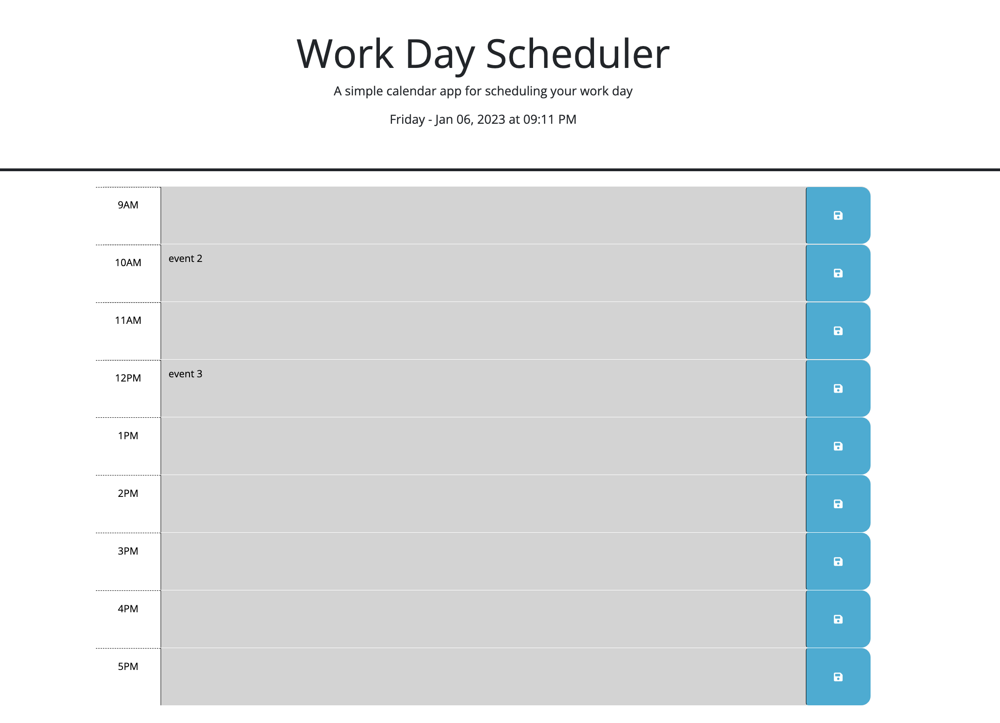

# workday-scheduler
## Technology Used 

| Technology Used         | Resource URL           | 
| ------------- |:-------------:| 
| HTML    | [https://developer.mozilla.org/en-US/docs/Web/HTML](https://developer.mozilla.org/en-US/docs/Web/HTML) | 
| CSS     | [https://developer.mozilla.org/en-US/docs/Web/CSS](https://developer.mozilla.org/en-US/docs/Web/CSS)      |   
| JQuery | [https://api.jquery.com/](https://api.jquery.com/) |
| Git | [https://git-scm.com/](https://git-scm.com/)     |    

 

## Description 

This project is to display the work day schedule for any given day. Past hours are indicated as grey, present hour is indicated as red and future hours are indicated as green inaccordance with the current time.

The user can enter any schedule for the time block and save it using save button. This saved schedule can be viewed any time by storing and retreiving from local storage.Any event can be replaced/deleted and saved to local storage.

 

## Usage

workday scdedule page with color codes for each hour.

 

List of schedule that can be viewed any time

 

## Learning Points
* event listener using jquery
* significance of 'this' attribute
* dom traversal using jquery

 

## Links

Github repo - https://github.com/srinithi19/workday-scheduler
 
Application URL - https://srinithi19.github.io/workday-scheduler/
 
